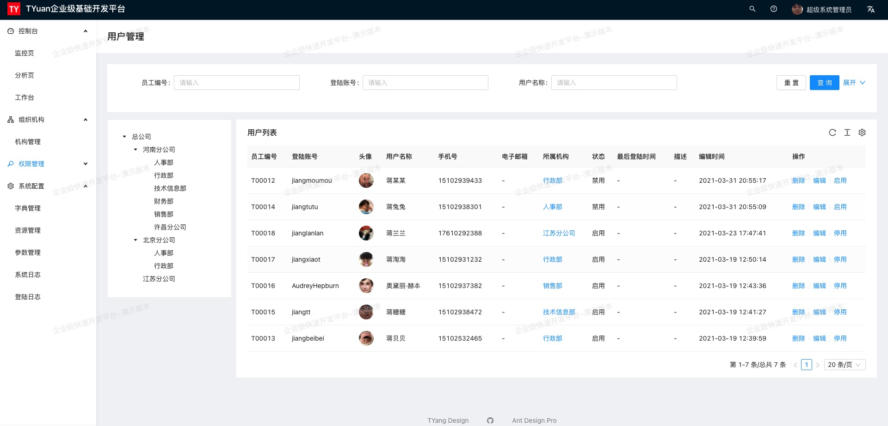

##### Tyuan微服务开发平台
* 采用前后端分离的模式，前端[Tyuan-web](https://github.com/j-tyuan/tyuan-web) （基于React 、 Pro Ant Design）
* 后端采用Spring Boot、Mybatis
* 项目结构简单易于快速掌握

##### 与其它类似项目的优势
* 轻量级，适合小项目的快速开发
* 完全免费，没有任何限制
* 完全遵守阿里巴巴编码规范

##### 演示地址
* [在线演示](http://base.tyuan.design)
* 账号：admin
* 密码：tyuan

##### 使用文档
* [在线文档](http://tyuan.design/)

##### 整体技术架构
* [前端](https://github.com/j-tyuan/tyuan-web) ：React/ [pro.ant.design](http://pro.ant.design)
* [后端](https://github.com/j-tyuan/tyuan-manager) ：Java/Spring Boot/Mybatis
* 数据库：Mysql
* 中间件：Redis

##### 技术支持
* [139672396](https://qm.qq.com/cgi-bin/qm/qr?k=rjUvWB3vTk9tP7pPGgwnmFv4jEacxz3R&jump_from=webapi) （QQ群 - 敏捷开发）

##### 安装运行
    # mvn clean install
    # cd manager
    # mvn clean package 
    # java -jar target/manager-1.0.jar --activate-profiles=dev
    
##### 特点
* 遵守apache license 2.0 开源协议
* 前后端分离
* 前端支持mock，不依赖后端API开发进度
* 配套的ApiService服务（Java Spring Boot）
* 高颜值，高性能，高可用
* 炼出典型模板/业务组件
* 丰富布局模式
* 内置浅色主题 / 暗黑主题
* 漂亮的 UI、极致的用户体验和细节处理

##### 权限
* 路由级别鉴权
* 侧边栏菜单鉴权
* 功能块鉴权
* 功能点鉴权
* 鉴权指令

#开源协议
Apache Licence 2.0 （英文原文） Apache Licence是著名的非盈利开源组织Apache采用的协议。该协议和BSD类似，同样鼓励代码共享和尊重原作者的著作权，同样允许代码修改，再发布（作为开源或商业软件）。 需要满足的条件如下：

  * 需要给代码的用户一份Apache Licence
  * 如果你修改了代码，需要在被修改的文件中说明。
  * 在延伸的代码中（修改和有源代码衍生的代码中）需要带有原来代码中的协议，商标，专利声明和其他原来作者规定需要包含的说明。
  * 如果再发布的产品中包含一个Notice文件，则在Notice文件中需要带有Apache Licence。你可以在Notice中增加自己的许可，但不可以表现为对Apache Licence构成更改。 Apache Licence也是对商业应用友好的许可。使用者也可以在需要的时候修改代码来满足需要并作为开源或商业产品发布/销售。
  
#用户须知
* 允许免费用于学习、毕设、公司项目、私活等。
* 对未经过授权和不遵循 Apache 2.0 协议二次开源或者商业化我们将追究到底。
* 禁止用于任何非法项目

# 界面

